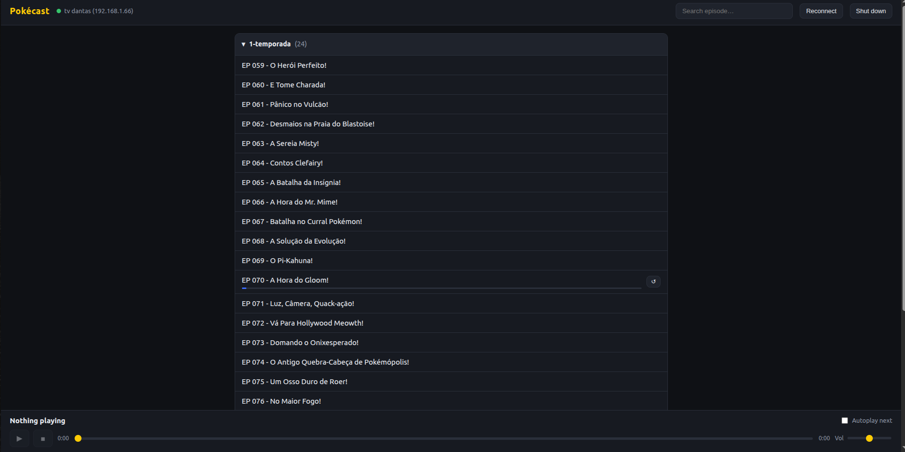

# Pokécast

Watch the videos on your PC on a Smart TV (Chromecast / Android TV) straight from your browser: folder-grouped list, player controls, autoplay and resume-where-you-left-off.

> I built this to watch Pokémon with my son, but it works for any kind of video.



## Requirements

- Linux with `ufw`
- Node 20+ (recommended via [nvm](https://github.com/nvm-sh/nvm))
- Smart TV with built-in Chromecast (Android TV) on the same Wi-Fi network

## Install

1. Copy the Pokécast files (`server.js`, `index.html`, `package.json`, `start.sh`) into the folder where your videos live.
2. Organize the videos into subfolders (e.g. one per season) — the UI groups by folder.
3. Make the launcher executable (once):
   ```bash
   chmod +x start.sh
   ```

## Usage

```bash
./start.sh
```

- The first run asks for `sudo` once to open the firewall for your local network.
- It opens `http://localhost:8099`. Click an episode to play it on the TV.
- To stop: `Ctrl-C` in the terminal, or the **Shut down** button on the page.

## Features

- Videos grouped by subfolder, with search
- Play/pause, stop, seek and volume
- Autoplay the next episode in the folder
- Remembers where you stopped (auto-resume + per-episode progress bar; `↺` restarts)
- Finds the TV on its own (mDNS) — the TV's IP can change without breaking anything

## Configuration (optional)

| Variable | Default | What for |
|---|---|---|
| `POKECAST_TV` | first TV found | TV name, in case you have more than one cast device |
| `POKECAST_PORT` | `8099` | Server port |

```bash
POKECAST_TV="living room" ./start.sh
```

## How it works

The PC does not push the picture: it hands the TV a URL and the **TV fetches the video** from a local HTTP server. That is why the firewall has to allow inbound traffic from your network (the launcher does this for you).

```
browser  ->  server (PC)  ->  "play this URL"  ->  TV
                ^                                    |
                +--------  TV fetches video (HTTP) --+
```

`Range` support (HTTP 206) is what makes the seek bar work.

## Troubleshooting

- **Says it is playing but nothing shows on the TV**: the TV may be on another input (HDMI). Switch to Home/TV, or enable HDMI-CEC so it switches automatically.
- **"TV not found"**: make sure the TV is on and on the same network, then click **Reconnect**.
- **Video does not load on the TV**: firewall. If you changed networks, run `sudo ufw allow from <your_subnet>` and delete the `.firewall-done` file.
- **Codec**: native casting plays H.264/AAC. An H.265/HEVC file may fail — in that case use a USB stick + VLC installed on the TV.
